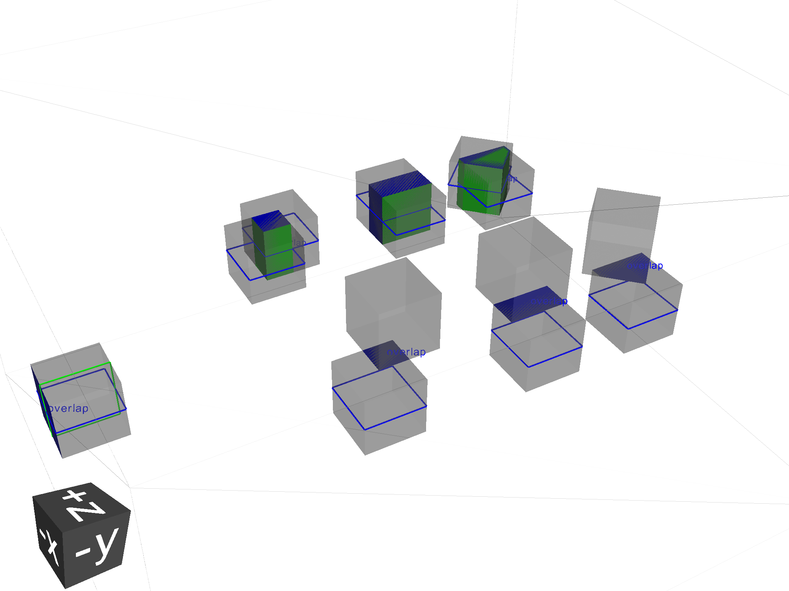

===============================
Basic python geometry scripting
===============================

Geant4 python scripting 
-----------------------

Making use of pyg4ometry requires the following modules 

.. code-block :: python

   import pyg4ometry               

To make a simple geometery of a box located at the origin

.. code-block :: python
   :linenos:

   # load pyg4ometry
   import pyg4ometry               

   # registry to store gdml data
   reg  = pyg4ometry.geant4.Registry()
  
   # world solid and logical
   ws   = pyg4ometry.geant4.solid.Box("ws",50,50,50,reg)
   wl   = pyg4ometry.geant4.LogicalVolume(ws,"G4_Galactic","wl",reg)

   # box placed at origin
   b1   = pyg4ometry.geant4.solid.Box("b1",10,10,10,reg)
   b1_l = pyg4ometry.geant4.LogicalVolume(b1,"G4_Fe","b1_l",reg)
   b1_p = pyg4ometry.geant4.PhysicalVolume([0,0,0],[0,0,0],b1_l,"b1_p",wl,reg)

   # visualise geometry
   v = pyg4ometry.visualisation.VtkViewer()
   v.addLogicalVolume(wl)
   v.addAxes(20)
   v.view()

Here is the vtk visualiser output of the above example

.. figure:: pythonscripting/pythonscripting1.tiff
   :alt: Simple python scripting example

GDML defines 
------------

In GDML there are multiple ``define`` objects that can be used parametrise 
geometry, materials etc. For example a GDML constant can be created in the 
following way 

.. code-block :: python

   # registry to store gdml data
   reg = pyg4ometry.geant4.Registry()

   # constant called x 
   x = pyg4ometry.gdml.Constant("x",10,reg)

The normal set of mathematical operations in python can be performed and 
evaluated

.. code-block :: python

   y = 2*x + 10
   y.eval()

.. code-block :: python

   >> 30

The constant ``x`` can of course be changed and ``y`` re-evaluated
   
.. code-block :: python

   x.setExpression(5)
   y.eval()

.. code-block :: python

   >> 20

So the box example above can be rewritten using constants

.. code-block :: python
   :linenos:     
   :emphasize-lines: 7-9,16

   # load pyg4ometry
   import pyg4ometry

   # registry to store gdml data
   reg  = pyg4ometry.geant4.Registry()

   bx = pyg4ometry.gdml.Constant("bx","10",reg,True)
   by = pyg4ometry.gdml.Constant("by",2*bx,reg,True)
   bz = pyg4ometry.gdml.Constant("bz",2*by,reg,True)

   # world solid and logical
   ws   = pyg4ometry.geant4.solid.Box("ws",50,50,50,reg)
   wl   = pyg4ometry.geant4.LogicalVolume(ws,"G4_Galactic","wl",reg)

   # box placed at origin
   b1   = pyg4ometry.geant4.solid.Box("b1",bx,by,bz,reg)
   b1_l = pyg4ometry.geant4.LogicalVolume(b1,"G4_Fe","b1_l",reg)
   b1_p = pyg4ometry.geant4.PhysicalVolume([0,0,0],[0,0,0],b1_l,"b1_p",wl,reg)

   # visualise geometry
   v = pyg4ometry.visualisation.VtkViewer()
   v.addLogicalVolume(wl)
   v.addAxes(20)
   v.view()

.. note::
   All GDML defines (Constant, Variable, etc) can be used in the construction of other pyg4ometry classes 
   interchangably instead of floats or strings (where strings are either numbers or a GDML expression)

.. warning::
   Avoid reassigning variables used as defines, this can have unexpected consequences so for example 

.. code-block :: python
   :linenos:

   b1   = pyg4ometry.geant4.solid.Box("b1",bx,by,bz,reg)
   b1.pX = 20              # do not do this
   b1.pX.setExpression(20) # rather do this

Solids 
------

The python geant4 solids match the Geant4 constructors as much possible (different constructor signatures are not supported in python). For example looking at the ``G4Box`` class

.. code-block :: python

   pyg4ometry.geant4.solid.Box(name, pX, pY, pZ, registry, lunit)

.. code-block :: c++

   G4Box(const G4String& pName, G4double  pX, G4double  pY, G4double pZ)

Materials 
---------

As with solids materials are defined in a similar way to Geant4 C++. Python
does not have overloaded contrcutors, so unique signatures are needed, in 
constrast to Geant4.  

To define a material from the Geant4 predefined materials 

.. code-block :: python
   :emphasize-lines: 2-3
   :linenos:

   import pyg4ometry.geant4 as _g4
   wm = _g4.MaterialPredefined("G4_Galactic")
   bm = _g4.MaterialPredefined("G4_Fe")

To define a single element in terms of atomic number, atmoic mass and density.

.. code-block :: python
   :emphasize-lines: 2-3
   :linenos:

   import pyg4ometry.geant4 as _g4
   wm = _g4.MaterialSingleElement("galactic",1,1.008,1e-25,reg)   # low density hydrogen
   bm = _g4.MaterialSingleElement("iron",26,55.8452,7.874,reg)    # iron at near room temp

To define a compound two elements using the mass fraction

.. code-block :: python
   :emphasize-lines: 2
   :linenos:

   import pyg4ometry.geant4 as _g4
   wm = _g4.MaterialCompound("air",1.290e-3,2,reg)
   ne = _g4.ElementSimple("nitrogen","N",7,14.01)
   oe = _g4.ElementSimple("oxygen","O",8,16.0)
   wm.add_element_massfraction(ne,0.7)
   wm.add_element_massfraction(oe,0.3)
   bm = _g4.MaterialSingleElement("iron",26,55.8452,7.874,reg)    # iron at near room temp

To define a compound using number of atoms 

.. code-block :: python
   :emphasize-lines: 2
   :linenos:

   import pyg4ometry.geant4 as _g4
   bm = _g4.MaterialCompound("plastic",1.38,3,reg)    # Generic PET C_10 H_8 O_4
   he = _g4.ElementSimple("hydrogen","H",1,1.008)
   ce = _g4.ElementSimple("carbon","C",6,12.0096)
   oe = _g4.ElementSimple("oxygen","O",8,16.0)
   bm.add_element_natoms(he,8)
   bm.add_element_natoms(ce,10)
   bm.add_element_natoms(oe,4)

Material as a mixture of materials 

.. code-block :: python
   :emphasize-lines: 2
   :linenos:

   import pyg4ometry.geant4 as _g4
   bm     = _g4.MaterialCompound("YellowBrass_C26800", 8.14, 2, reg)
   copper = _g4.MaterialPredefined("G4_Cu")
   zinc   = _g4.MaterialPredefined("G4_Zn")
   bm.add_material(copper, 0.67)
   bm.add_material(zinc, 0.33)

Example of elements formed by isotopes

.. code-block :: python
   :emphasize-lines: 4
   :linenos:

   import pyg4ometry.geant4 as _g4
   u235 = _g4.Isotope("U235", 92, 235, 235.044)
   u238 = _g4.Isotope("U238", 92, 238, 238.051)
   uranium = _g4.ElementIsotopeMixture("uranium", "U", 2)
   uranium.add_isotope(u235, 0.00716)
   uranium.add_isotope(u238, 0.99284)
   bm = _g4.MaterialCompound("natural_uranium", 19.1, 2, reg)
   bm.add_element_massfraction(uranium, 1) 

Detector contruction 
--------------------

This largely proceeds in exactly the same way as in G4 or GDML. Hierarchy of solids, booleans, logical, physical (replica, division, param) volumes.

Optical surfaces 
----------------

Registry and GDML output
------------------------

Strictly speaking a registry class to store all of the GDML is not required. 
As with normal Geant4 given a ``lv`` pointer it should possible to form an aggregration 
hierarchy that contains all nessessary objects. Now GDML breaks this as the
structure is built up using ``name`` tags. For example a placement requires 
a position. In G4 this would just be a pointer to an transformation object, but GDML 
has two mechanisms to represent this, firstly child nodes of a PhysicalVolume tag 
or secondly a position define, see below

The registry class is a storage class for a complete GDML file. At the
construction stage of almost all objects a registry is required. If the 
object is added to the resistry then it will appear explicitly in the GDML 
output

Visualisation
-------------

Any logical volume ``lv`` can be visualised using 

.. code-block :: python
   :linenos:

   v = pyg4ometry.visualisation.VtkViewer()
   v.addLogicalVolume(lv)
   v.addAxes(20)
   v.view()

which will open a Vtk render window. The render window now receives keyboard and mouse commands. 
To exit render window ``q``, to restart interaction with the visualiser 

.. code-block :: python

   v.start()

Overlap checking
----------------

Given all the PVs (daughters) of a LV (mother) should be bounded by the LV/mother solid. It is
possible check between all daugher solid meshes and between daughers and the mother solid mesh.
Given an ``LV`` this check can be performed by calling the following code.

.. code-block :: python
   :emphasize-lines: 5
   :linenos:

   # cd pyg4ometry/pyg4ometry/test/pythonGeant4
   import pyg4ometry
   r  = pyg4ometry.freecad.Reader("./T103_overlap_copl.gdml")
   l = r.getRegistry().getWorldVolume()
   l.checkOverlaps(recursive=False,coplanar=True,debugIO=False)   
   v = pyg4ometry.visualisation.VtkViewer() 
   v.addLogicalVolume(l)
   v.view()

There is no output when ``checkOverlaps`` is called but a overlap, protrusion or 
coplanar meshes are computed and stored in the logical volume instance and displayed
by the ``VtkViewer``

GDML output 
-----------

To write an GDML file file given a ``pyg4ometry.geant4.registy reg``   

.. code-block :: python
   :emphasize-lines: 3
   :linenos:

   import pyg4ometry
   w = p4gometry.gdml.Writer()
   w.addDetector(reg)
   w.write('./file.gdml')
   w.writeGmadTester('./file.gmad')

