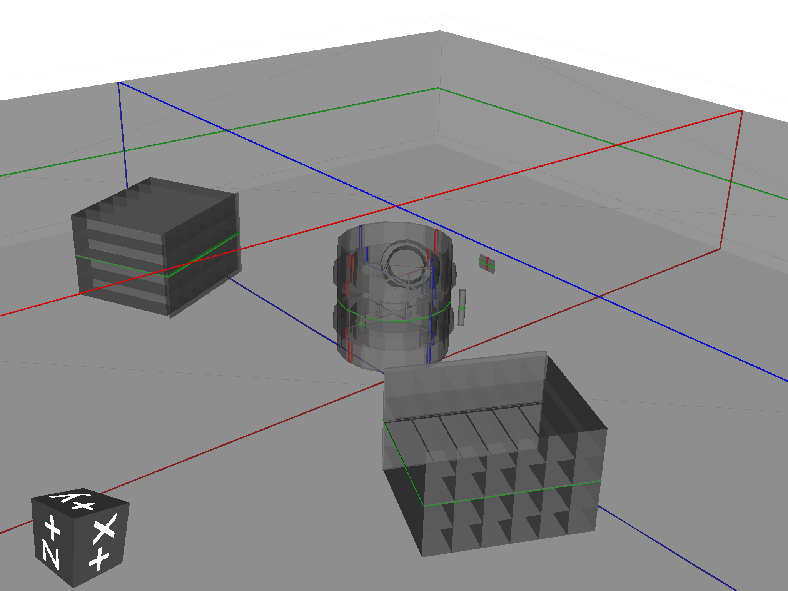
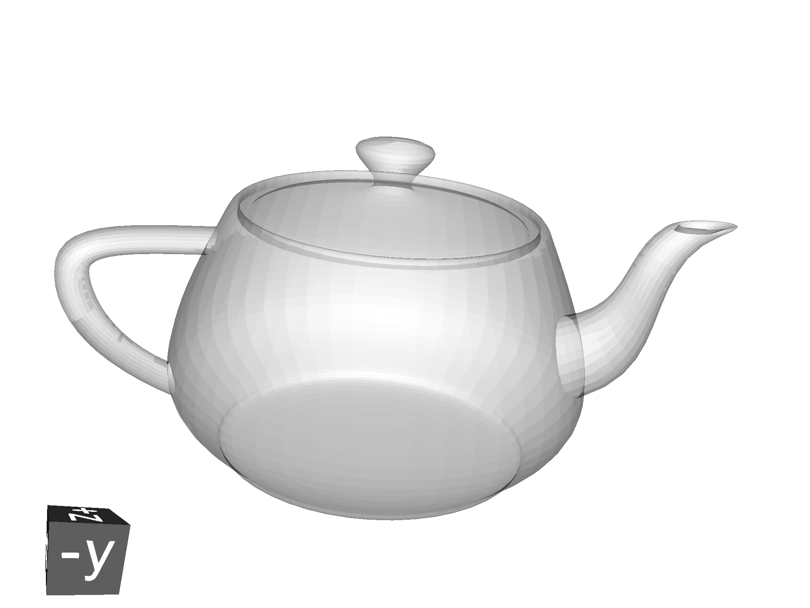
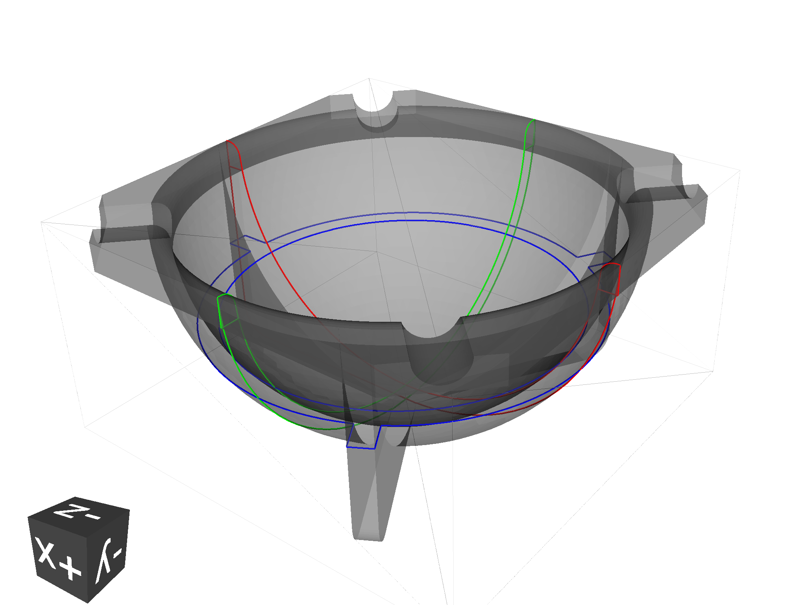
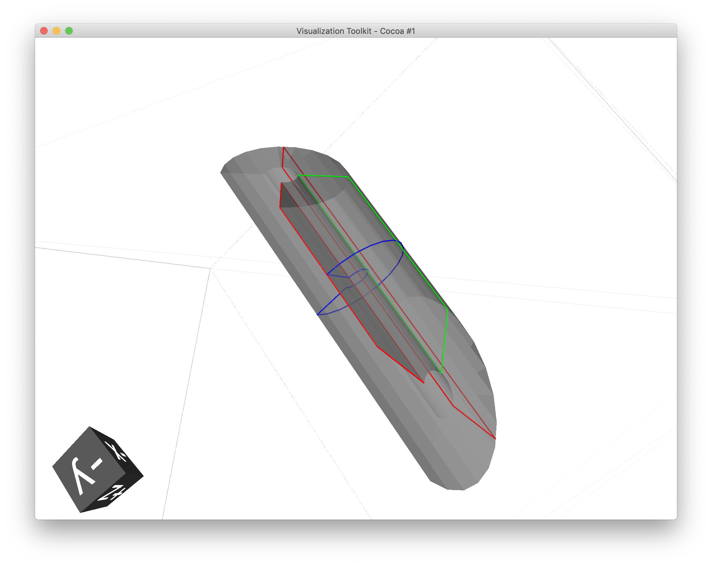
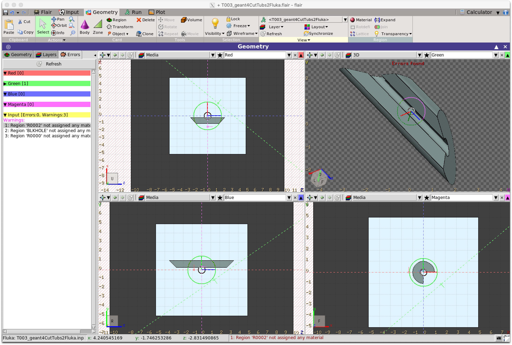

=========
Tutorials
=========

GDML loading 
------------

In directory ``pyg4ometry/pyg4ometry/test/gdmlG4examples/ChargeExchangeMC/``

.. code-block :: python
   :linenos:

   import pyg4ometry
   r = pyg4ometry.gdml.Reader("lht.gdml")
   l = r.getRegistry().getWorldVolume()
   v = pyg4ometry.visualisation.VtkViewer()
   v.addLogicalVolume(l)
   v.view()

STL loading 
-----------

STL files are typically used for a single watertight solid mesh. This mesh is 
converted to a TesselatedSolid and then a logical volume which can be placed 
in a geometry. In directory ``pyg4ometry/pyg4ometry/test/stl``.

.. code-block :: python

   import pyg4ometry
   reg = pyg4ometry.geant4.Registry()
   r = pyg4ometry.stl.Reader("utahteapot.stl")
   l = r.logicalVolume("test","G4_Cu",reg)
   v = pyg4ometry.visualisation.VtkViewer()
   v.addLogicalVolume(l)
   v.view()

STEP/STP loading
----------------

In directory ``pyg4ometry/pyg4ometry/test/freecad``

.. code-block :: python 
   :linenos:

   import pyg4ometry
   r  = pyg4ometry.freecad.Reader("./08_AshTray.step")
   r.relabelModel()
   r.convertFlat()
   l = r.getRegistry().getWorldVolume()
   v = pyg4ometry.visualisation.VtkViewer()
   v.addLogicalVolume(l)
   v.view()

Fluka loading and conversion to Geant4
--------------------------------------

Merging geometry
----------------

There are ways to incorperate geometry from multiple sources in GDML. This has potentially 
lots of problems as each file needs to be a well formed GDML file and care has to be taken 
with degenerate names from the different sources. 

Assembly conversion
-------------------

Given two sources of geometry, placement of top level world logical volume solids will 
likely result in an overlap. To avoid these types of problems, it might required to convert
one of the logical volumes to an AssemblyVolume.

STL output
----------

To write an STL file from ``m = volume.pycsgmesh()`` 

.. code-block :: python
   :linenos:

    vtkConverter = vtk.Convert()
    vtkPD        =  vtkConverter.MeshListToPolyData(m)
    r = vtk.WriteSTL("file.stl",vtkPD)

GDML Conversion to Fluka
------------------------

It is possible convert a pyg4ometry geometry to Fluka. This is currently a work in 
progress and not all geant4-GDML constructions are implemented, although they can
be quickly added. Given a LV variable named ``logical``  

.. code-block :: python
   :linenos:

   import pyg4ometry
   reader = pyg4ometry.gdml.Reader("input.gdml")
   logical = reader.getRegistry().getWorldVolume()      
   freg = pyg4ometry.convert.geant4Logical2Fluka(logical)
   w = pyg4ometry.fluka.Writer()
   w.addDetector(freg)
   w.write("FileName.inp")

If you want to load a file into Flair then a flair file can be written based on ``FileName.inp`` using the following 

.. code-block :: python
   :linenos:

    extent = logical.extent(includeBoundingSolid=True)
    f = pyg4ometry.fluka.Flair("FileName.inp",extent)
    f.write("FileName.flair")

Here is an example (viewed in Flair) of a simple geant G4 solid that has been converted to Fluka using this 
method

.. note::
   All GDML placements are respected in the conversion from GDML to Fluka, for both Placements and 
   Boolean Solids. So for example a tree of LV-PV placements are reduced into a single transformation 
   of a LV into a global coordinate space for FLUKA. A similar process is used for a tree of CGS 
   operations.

.. warning::

   Currently there are some things which are not implemented in the conversion. 1) Materials, 2) Scaled solids, 
   3) Reflections in placements, 4) Division, replica and parametrised placements. Some of these are straight
   foward to implement, like Materials and the non-Placement physical volumes can be done quickly if a user 
   requires it.